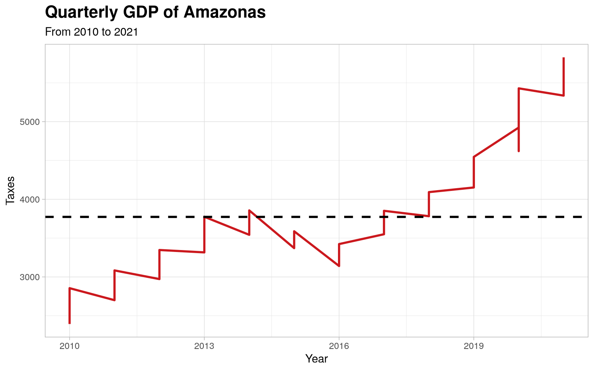
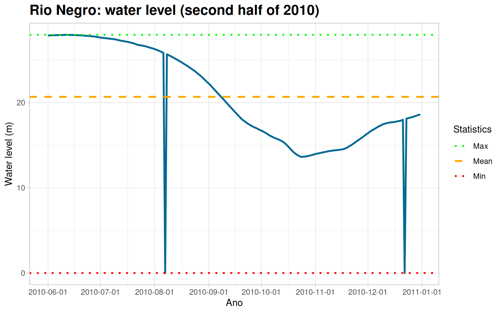
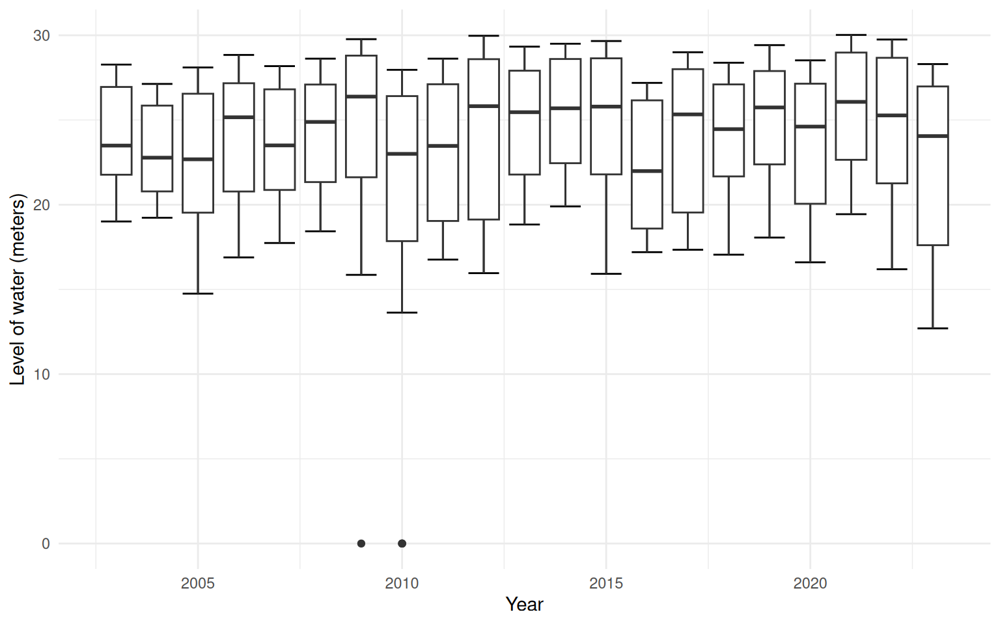
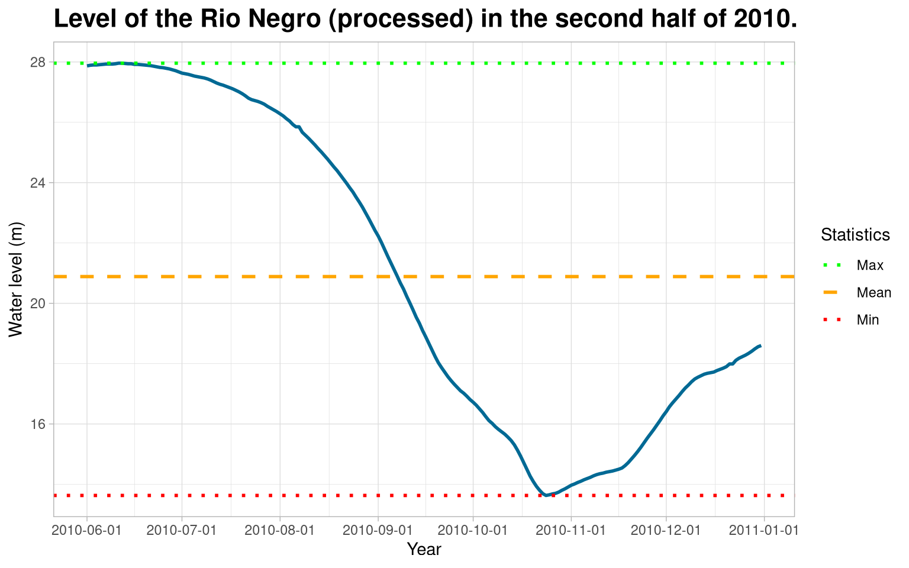

See how easily you can create plots from the data available in this
package

```r
library(amazonasdatahub)
```

### Time Series Example

Using `dplyr` and `ggplo2` for quick and practical data analysis:

#### Quarterly GDP of Amazonas

```r
require(dplyr)
require(ggplot2)

pib_trimestral %>%
  select(year, taxes) %>%
  ggplot(., aes(x = year, y = taxes)) +
  geom_line(size = 1L, colour = "#cb181d") +
  geom_hline(
        yintercept = mean(pib_trimestral$taxes),
        linetype = "dashed",
        size = 1
  ) +
  theme_light() +
  theme(
        plot.title = element_text(face = "bold", size = 16)
  ) +
  labs(
       x = "Year",
       y = "Taxes",
       title = "Quarterly GDP of Amazonas",
       subtitle = "From 2010 to 2021"
  )
```



#### Rio Negro: water level

<details class="code-fold">
<summary>Code</summary>

```r
require(dplyr)
require(ggplot2)

# Filtering dates for the second half of 2010
rionegro_amazonas_2010_02 <- rionegro_amazonas %>%
  filter(date >= "2010-06-01" & date <= "2010-12-31")

# Graphical Visualization
rionegro_amazonas_2010_02 %>%
  ggplot(., aes(x = date, y = level_m)) +
  geom_line(size = 1L, colour = "#006994") +
  geom_hline(
        aes(
            yintercept = mean(rionegro_amazonas_2010_02$level_m),
            color = "Mean"
        ),
        linetype = "dashed",
        size = 1
  ) +
  geom_hline(
        aes(
            yintercept = min(rionegro_amazonas_2010_02$level_m),
            color = "Min"
        ),
        linetype = "dotted",
        size = 1
  ) +
  geom_hline(
        aes(
            yintercept = max(rionegro_amazonas_2010_02$level_m),
            color = "Max"
        ),
        linetype = "dotted",
        size = 1
  ) +
  scale_color_manual(
        name = "Statistics",
        values = c(
                   "Mean" = "orange",
                   "Min" = "red",
                   "Max" = "green"
                  )) +
  scale_x_date(
        date_breaks = "1 month"
  ) +
  theme_light() +
  theme(
        plot.title = element_text(face = "bold", size = 16)
  ) +
  labs(
       x = "Ano",
       y = "Water level (m)",
       title = "Rio Negro: water level (second half of 2010)"
  )
```

</details>



## Perform detailed analysis

Part of the Statistician’s job is to identify and find certain errors
and inconsistencies in the data. As we can see, the graph above shows
that the level of the Rio Negro in meters was at 0. This is strange and
uncommon, as it would indicate that the river completely dried up.

We can plot boxplots to get an idea of the outlier values.



We can conclude that these “0” values correspond to missing data (NAs),
which were filled with a zero value. We will replace these zero values
with NAs.

```r
require(tidyr)
rionegro_amazonas_2010_02 <- rionegro_amazonas_2010_02 %>%
  mutate(
    level_m = case_when(
      date == "2010-08-07" ~ NA_real_,
      date == "2010-12-22" ~ NA_real_,
      TRUE ~ as.numeric(level_m)
    ),
    increase_decrease_cm = case_when(
      date == "2010-08-07" ~ NA_real_,
      date == "2010-12-22" ~ NA_real_,
      TRUE ~ as.numeric(increase_decrease_cm)
    )
  )
```

### Handling Missing Values

Now that we have defined the missing values, we can choose a method to
handle them. In this example, we will use Forward-Fill, but we encourage
you to research and try other methods to learn different ways of
handling missing values. With the cleaned data, we can remake the graph
and visualize the river level. Thus, it is evident that handling these
outlier values, which were considered missing, made a big difference in
the conclusions about the Rio Negro’s water level data.

```r
require(tidyr)

rionegro_amazonas_2010_02 <- rionegro_amazonas_2010_02 %>%
  fill(level_m, increase_decrease_cm)
```

With the processed data, we can recreate the plot and visualize the
level of the Rio Negro.

### Graphical Visualization of Rio Negro (2010/2)

<details class="code-fold">
<summary>Code</summary>

```r
require(dplyr)
require(ggplot2)

# Visualização Gráfica
rionegro_amazonas_2010_02 %>%
  ggplot(., aes(x = date, y = level_m)) +
  geom_line(size = 1L, colour = "#006994") +
  geom_hline(
        aes(
            yintercept = mean(rionegro_amazonas_2010_02$level_m),
            color = "Mean"
        ),
        linetype = "dashed",
        size = 1
  ) +
  geom_hline(
        aes(
            yintercept = min(rionegro_amazonas_2010_02$level_m),
            color = "Min"
        ),
        linetype = "dotted",
        size = 1
  ) +
  geom_hline(
        aes(
            yintercept = max(rionegro_amazonas_2010_02$level_m),
            color = "Max"
        ),
        linetype = "dotted",
        size = 1
  ) +
  scale_color_manual(
        name = "Statistics",
        values = c(
                   "Mean" = "orange",
                   "Min" = "red",
                   "Max" = "green"
                  )) +
  scale_x_date(
        date_breaks = "1 month"
  ) +
  theme_light() +
  theme(
        plot.title = element_text(face = "bold", size = 16)
  ) +
  labs(
       x = "Year",
       y = "Water level (m)",
       title = "Level of the Rio Negro (processed) in the second half of 2010."
  )
```

</details>



Therefore, it is noteworthy that the treatment of these outlie values,
which were considered missing, made all difference in the conclusion
about the data on the level of the Rio Negro.
