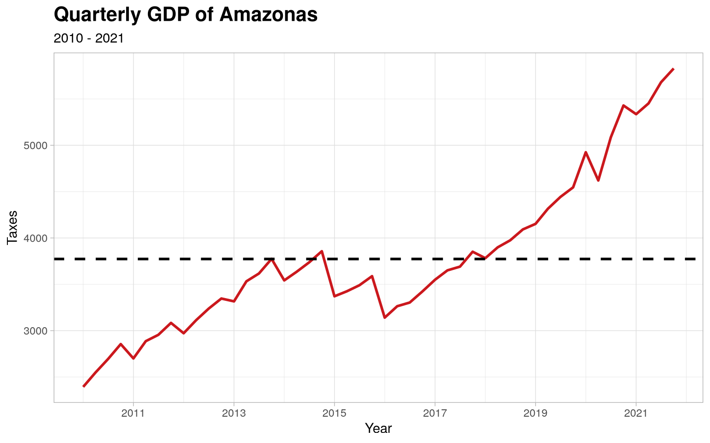

See how easily you can create plots from the data available in this
package

```r
library(amazonasdatahub)
```

# Datasets tutorials

For each dataset, you can check the documentation using `?` before the
dataset name.

```r
?agriculture_idam
?aids_amazonas
?humidity_manaus
?malaria_amazonas
?pib_trimestral
?rionegro_amazonas
?school_read_levels
```

## Scatter plot of planted area and harvested area from cassava production

The dataset `agriculture_idam` provides crop production data from
Amazonas. We can make a scatter plot of planted area and harvested area
of filtered productions, In this example, we will use cassava
production.

To plot a simple scatter plot in R, without using external packages, we
will use the `plot` function.

```r
# Filtering data
mandioca_prod <- agriculture_idam[agriculture_idam$cultivation == "Mandioca", ]

# Scatter Plot
plot(
  mandioca_prod$planted,
  mandioca_prod$harvested,
  xlab = "Planted area (hectare)",
  ylab = "Harvested area (hectare)",
  main = "Cassava production in Amazonas",
  sub = "Planted area x Harvested Area"
)
```


## Time Series of AIDS case counts in Manaus

The dataset `aids_amazonas` contains data of the AIDS occurrences in
each municipality from Amazonas.

One of the analysis that can be made is: visualize the time series of
counts filtered by municipality, where each case is grouped by the
sex/gender of each observation. To do this, we will use the `dplyr`
package to structure the data and the `ggplot2` package to create and
customize the chart.

```r
# Loading dplyr and ggplot to structure the data
require(dplyr)
require(ggplot2)

# Filtering by municipality and ploting case count by gender
aids_amazonas %>%
  filter(name_muni == "Manaus") %>%
  group_by(gender) %>%
  ggplot(aes(x = year, y = cases, group = gender, color = gender)) +
  geom_line() +
  scale_color_manual(values = c("blue", "red")) +
  theme_minimal() +
  labs(
    title = "AIDS ocurrences in Manaus (2011-2023)",
    x = "Year",
    y = "Case count",
    color = "Gender"
  )
```


## Time Series of relative humidity from Manaus (2010 - 2020)

The `humidity_manaus` consists of the minimum relative humidity observed
in the city of Manaus from January 2009 to December 2020. We can
visualize the time series of the relative humidity during this time
interval.

Using `dplyr`, we can create a date column, which will be composed of
the month and year, and `ggplot2`, we can create the time series chart.

```r
# Loading dplyr and ggplot to structure the data
require(dplyr)
require(ggplot2)

# Creating date column and plotting the time series
humidity_manaus %>%
  mutate(date = as.Date(paste0(year, "-", month, "-","01"))) %>%
  ggplot(aes(x = date, y = rh)) +
  geom_line() +
  theme_minimal() +
  labs(
    title = "Relative Humidity of Amazonas (2010 - 2020)",
    x = "Date",
    y = "Relative Humidity"
  )
```


## Time series of Quarterly GDP of Amazonas

With the data from `pib_trimestral`, we can perform analyses regarding
the patterns observed in the distribution of data over the observed
interval (2010 to 2021).

Using `dply` and \``ggplot2`, we can select the variables of interest
and creating a line chart. This example will demonstrate this
application, as well as more advanced customizations, including colors,
title font formatting and line types.

```r
# Loading dplyr and ggplot2
require(dplyr)
require(ggplot2)

# Selecting only year and taxes and ploting
pib_trimestral %>%
  select(year, taxes) %>%
  ggplot(., aes(x = year, y = taxes)) +
  geom_line(linewidth = 1L, colour = "#cb181d") +
  geom_hline(
    yintercept = mean(pib_trimestral$taxes),
    linetype = "dashed",
    size = 1
  ) +
  theme_light() +
  theme(
    plot.title = element_text(face = "bold", size = 16)
  ) +
  labs(
    x = "Year",
    y = "Taxes",
    title = "Quarterly GDP of Amazonas",
    subtitle = "2010 - 2021"
  )
```



## Boxplots of water level (in meters) of Rio Negro (Amazonas)

With the data provided by `rionegro_amazonas`, one of the analysis that
can be done is visualizing a chart of boxplots of water level over the
years.

We will be using `dplyr` and `ggplot2`.

```r
# Loading ggplot
require(ggplot2)

rionegro_amazonas %>%
  ggplot(aes(x = year, y = level_m, group = year)) +
  stat_boxplot(geom = "errorbar") +
  geom_boxplot() +
  theme_minimal() +
  labs(
    x = "Year",
    y = "Water level (m)"
  )
```


<details class="code-fold">
<summary>Code</summary>

```r
require(dplyr)
require(ggplot2)

# Filtering dates for the second half of 2010
rionegro_amazonas_2010_02 <- rionegro_amazonas %>%
  filter(date >= "2010-06-01" & date <= "2010-12-31")

# Graphical Visualization
rionegro_amazonas_2010_02 %>%
  ggplot(., aes(x = date, y = level_m)) +
  geom_line(size = 1L, colour = "#006994") +
  geom_hline(
        aes(
            yintercept = mean(rionegro_amazonas_2010_02$level_m),
            color = "Mean"
        ),
        linetype = "dashed",
        size = 1
  ) +
  geom_hline(
        aes(
            yintercept = min(rionegro_amazonas_2010_02$level_m),
            color = "Min"
        ),
        linetype = "dotted",
        size = 1
  ) +
  geom_hline(
        aes(
            yintercept = max(rionegro_amazonas_2010_02$level_m),
            color = "Max"
        ),
        linetype = "dotted",
        size = 1
  ) +
  scale_color_manual(
        name = "Statistics",
        values = c(
                   "Mean" = "orange",
                   "Min" = "red",
                   "Max" = "green"
                  )) +
  scale_x_date(
        date_breaks = "1 month"
  ) +
  theme_light() +
  theme(
        plot.title = element_text(face = "bold", size = 16)
  ) +
  labs(
       x = "Year",
       y = "Water level (m)",
       title = "Rio Negro: water level (second half of 2010)"
  )
```

</details>


### Missing data and outliers

Part of the Statistician’s job is to identify and find certain errors
and inconsistencies in the data. As we can see, the graph above shows
that the level of the Rio Negro in meters was at 0. This is strange and
uncommon, as it would indicate that the river completely dried up.

We can conclude that these “0” values correspond to missing data (NAs),
which were filled with a zero value. We will replace these zero values
with NAs.

```r
require(tidyr)
rionegro_amazonas_2010_02 <- rionegro_amazonas_2010_02 %>%
  mutate(
    level_m = case_when(
      date == "2010-08-07" ~ NA_real_,
      date == "2010-12-22" ~ NA_real_,
      TRUE ~ as.numeric(level_m)
    ),
    increase_decrease_cm = case_when(
      date == "2010-08-07" ~ NA_real_,
      date == "2010-12-22" ~ NA_real_,
      TRUE ~ as.numeric(increase_decrease_cm)
    )
  )
```

### Handling Missing Values

Now that we have defined the missing values, we can choose a method to
handle them. In this example, we will use Forward-Fill, but we encourage
you to research and try other methods to learn different ways of
handling missing values.

```r
require(tidyr)

rionegro_amazonas_2010_02 <- rionegro_amazonas_2010_02 %>%
  fill(level_m, increase_decrease_cm)
```

With the processed data, we can recreate the plot and visualize the
level of the Rio Negro.

<details class="code-fold">
<summary>Code</summary>

```r
require(dplyr)
require(ggplot2)

# Graphical Visualization
rionegro_amazonas_2010_02 %>%
  ggplot(., aes(x = date, y = level_m)) +
  geom_line(size = 1L, colour = "#006994") +
  geom_hline(
        aes(
            yintercept = mean(rionegro_amazonas_2010_02$level_m),
            color = "Mean"
        ),
        linetype = "dashed",
        size = 1
  ) +
  geom_hline(
        aes(
            yintercept = min(rionegro_amazonas_2010_02$level_m),
            color = "Min"
        ),
        linetype = "dotted",
        size = 1
  ) +
  geom_hline(
        aes(
            yintercept = max(rionegro_amazonas_2010_02$level_m),
            color = "Max"
        ),
        linetype = "dotted",
        size = 1
  ) +
  scale_color_manual(
        name = "Statistics",
        values = c(
                   "Mean" = "orange",
                   "Min" = "red",
                   "Max" = "green"
                  )) +
  scale_x_date(
        date_breaks = "1 month"
  ) +
  theme_light() +
  theme(
        plot.title = element_text(face = "bold", size = 16)
  ) +
  labs(
       x = "Year",
       y = "Water level (m)",
       title = "Level of the Rio Negro (processed) in the second half of 2010."
  )
```

</details>


Therefore, it is noteworthy that the treatment of these outlie values,
which were considered missing, made all difference in the conclusion
about the data on the level of the Rio Negro.
